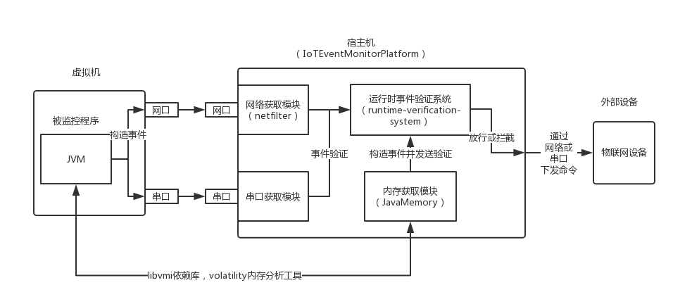

# IoTEventMonitorPlatform

物联网事件监控平台系统
>*by chenkuan*

# conf

- gui_conf.xml 页面配置
- gui_conf_default.xml 默认页面配置

# output

仅在构建后生成，包含输出的可执行文件
# src

- GUI 图形界面部分，使用QT5编写
- manager 后台线程，收集事件、验证事件
- netfilterClient 使用netlink与内核netfilter作事件交互
- serialPortClient 串口中继器，从串口获取事件
- tinyxml2 开源的xml解析工具
- verification 事件验证模块
  - rvsDFAInterface 状态机抽象接口
  - rvsDFA 具体的状态机

# IOT系统整体结构

>*by kong*

# 环境搭建

## 宿主机端

1. [**安装jdk 1.7**](http://blog.csdn.net/gatieme/article/details/52723931)
2. **安装IntelliJ IDEA**
3. **导入工程 EventSimulation4Java**
    - 选择maven 确保lib目录下的jar包导入到工程中
    - 修改DEFAULT_SERVER_IP，保证可以与该Server正常通信
    - 构建工程 File-Project Structure-Artifacts - “+” - JAR - Create JAR from Modules - Main Class
    - 在Project选项卡中选择 EventSimulation Directory for META-INF改为/home/kong/EventSimulation4Java/src 删掉/main/java
    - Build  Build - Build Artifasts - Build
   File - Project Structure - Libraries - "+" - Java - linux_x64.jar
    - 编译后会在项目根目录下生成out文件夹 其中包含EventSimulation4Java.jar
    - 然后将整个工程文件夹发送到虚拟机中

4. **安装CLion 安装CMake**
5. [**安装z3**](https://github.com/Z3Prover/z3)
6. **安装Git**
    - 并配置 参考廖学锋Git教程
7. **需要clone的工程有：**
    - IoTEventMonitorPlatform ----- 分支linux
    - runtime-verification-system - 分支master
    - tinyxml2 -------------------- 分支cpys
    - tinylog  -------------------- 分支master
    - netfilter ------------------- 分支develop
    - mxGraph --------------------- 分支master http://github.com/cpys/mxGraph.git

    - 各工程需要注意cmakelists中的路径，编译选项均为 build all
    - 编译顺序为 tinyxml2 -- tinylog -- runtime-verification-system -- IoTEventMonitorPlatform
    - 编译tinyxml2/tinylog/runtime-verification-system 会在lib中生成so文件
    - 编译IoTEventMonitorPlatform时 header - NetfilterConf - 中的路径需要改为 netfilter工程的路径

8. **IoTEventMonitorPlatform** 需要权限运行 可以选择
    - sudo运行CLion `sudo sh clion.sh`
    - sudo 运行 IoTEventMonitorPlatform
9. **内核模块相关命令**
    - insmod 模块名.ko ---- 安装模块
    - dmesg  ------------- 查看安装的内核模块
    - rmmod 模块名 -------- 删除模块
10. **安装KVM**
    - 输入命令 `egrep -c ‘(svm|vmx)’ /proc/cpuinfo` 以确定CPU是否支持硬件虚拟化，返回值大于0代表支持
    - 支持的情况下，进入BIOS系统开启CPU虚拟化
    - `sudo apt-get install qemu-kvm libvirt-bin bridge-utils virt-manager virtinst virt-viewer`
11. **在KVM中安装虚拟机**
    - 使用镜像ubuntu.img
    - ubuntu.img扩容
        - ubuntu.img默认大小为8G，后续使用会出现容量不足的情况，需要扩容
        - 扩容步骤：
            1. 宿主机端 `qemu-img resize ubuntu.img +5G`
            2. 启动虚拟机，虚拟机端输入命令 `sudo apt-get autoremove`清除出空间安装 gparted分区工具
            3. `sudo apt-get install gparted`
            4. 启动 `sudo gparted`
            5. 在gparted分工具中可以看到有5G空间是unallocated未分配的，参考这篇文章 [Expanding a linux disk with gparted](https://blog.mwpreston.net/2012/06/22/expanding-a-linux-disk-with-gparted-and-getting-swap-out-of-the-way/) 使未分配分区移动到swap分区之前并合并到dev1中
12. **设置虚拟机为桥接模式**
    - [参考文档](http://blog.csdn.net/chenhaifeng2016/article/details/78162759)
13. **给虚拟机添加串口**
    - 显示硬件详情 - 添加硬件 - Serial - Device - Psuedo TTY(pty)
14. **串口环境配置**
    - 宿主机端（Ubuntu系统）
        - 安装Cutecom工具：sudo apt-get install cutecom
        - 插串口线
    - 外部设备端（如windows系统）
        - 安装usb转串口驱动
        - 安装串口调试工具
    - Cutecom 和 调试工具配置相同的波特率、数据位、停止位等参数
    - 通过互相发送消息验证串口是否可用
## 虚拟机端 
- (可在宿主机中 ssh连接 命令为：ssh 虚拟机用户名@虚拟机ip）
1. 安装JDK
    - 拷贝java memory中的jdk文件夹 确保jdk为1.7
	可能添加源的方式行不通，使用解压方式
2. 从宿主机中传送过来的文件夹EventSimulation4Java中，进入到EventSimulation4Java.jar所在目录
    - 执行命令 `sudo java -Djava.library.path=pathof/RXTX -jar -Xint pathof/EventSimulation4Java.jar`

3. 运行EventSimulation程序
    - 如果错误提示 “没有清单主属性” 说明jar包打包有问题
    - 如果错误提示 包含library.path 说明动态链接库路径有问题
    - 如果错误提示 `Exception in thread "main" java.lang.NoClassDefFoundError: gnu/io/UnsupportedCommOperationException` [参考这里，复制文件](https://github.com/theChildinus/EventSimulation4Java)

## 监控平台配置

1. 虚拟机ip字面意思

2. 外部设备ip指 接受平台验证数据后的一方 需要与EventSimulation4Java/src/main/java/Net/NetEventSend.java 中的DEFAULT_SERVER_IP 相同 默认为10.108.164.222(这个IP应该访问不到了，请务必修改，否则netfilter会抓不到数据包！！！)
3. KVM伪终端指 虚拟机模拟串口的设备名 形如/dev/pts/19
4. 宿主机串口名称指 宿主机串口名字，需要另外一台设备与宿主机用串口线相连 可用工具cutecom测试
5. 状态机文件选择 需要选择状态机相关的xml文件

    - xml文件可以用mxGraph打开 mxGraph下载 git clone [mxGraph](http://github.com/cpys/mxGraph)
    - ant grapheditor 构建mxGraph工程 根据提示的网址访问
6. mxGraph中打开的状态机图
    - 需要有开始节点和结束节点 被指针指向的为开始节点 双环的节点为结束节点
    - 如果加载的状态机图 没有开始结点或者结束节点 会导致客户端宕机
    - 推荐使用目录runtime-verification-system/examples/中的simple-model.xml先做测试

# Q & A

1. - Q：netfilter模块中，不同的事件进入不同回调函数hook_func，那么多个事件是等待同一个完成量还是多个？
   - A：内核中对于网络数据包的处理是串行的，所以我们对于事件处理也是串行的，每个事件用一个完成量处理，多个事件依次处理。
2. - Q：netfilter工作在数据链路层，在与上层通信时，skb线性化会对解包和打包有什么影响，或者说上层应用是否也存在类似skb非线性化的问题？
   - A：skb线性化对上层无影响，因为这只是内核对于数据的一种存放方式，只会影响效率。
3. - Q：在hook_func中使用了skb线性化，目的是为了将page_data和frag_list的数据补充到线性buffer中，如果不使用线性化会导致什么情况？
   - A：网络数据是存在struct_sk_buff*结构中，数据较短（小于200字节）时，会存放在成员data中；数据较大时，会以比较复杂的方式存在二级指针下面，调用线性化函数会突破data字段长度200的限制，非线性存储的skb会转化成线性存储方式，这样直接访问data就能取出全部数据，不使用skb线性化的话会导致取不到所有网络数据的问题。
4. - Q：实验环境配置选择桥接模式而非NAT模式是出于什么的考虑？
   - A：是处于实际系统部署需求的考虑，即物联网服务（虚拟机）要和宿主机在同一网段下。
5. - Q：z3求解器验证过程耗时较长的问题是如何解决的？
   - A：Z3开始是每次验证时创建个solver，把所有表达式添加进去验证，所以耗时较长。后来改成只建一次solver，每次验证增量push进去表达式，验证完pop出去。
6. - Q: 乱序事件如何验证？
   - A：解决办法是连续事件枚举其全排列进行全部验证，即所有事件排列后依次通过单一事件验证接口才能表示该次排列通过验证。

# TODOLIST

1. 优化网络/串口/内存处理逻辑